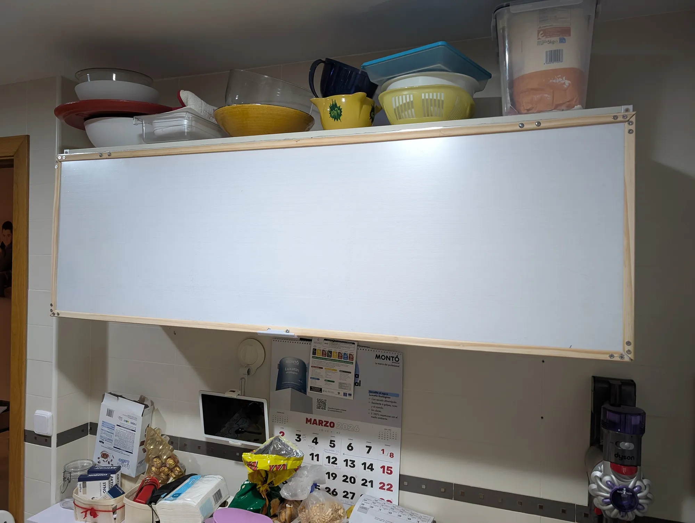
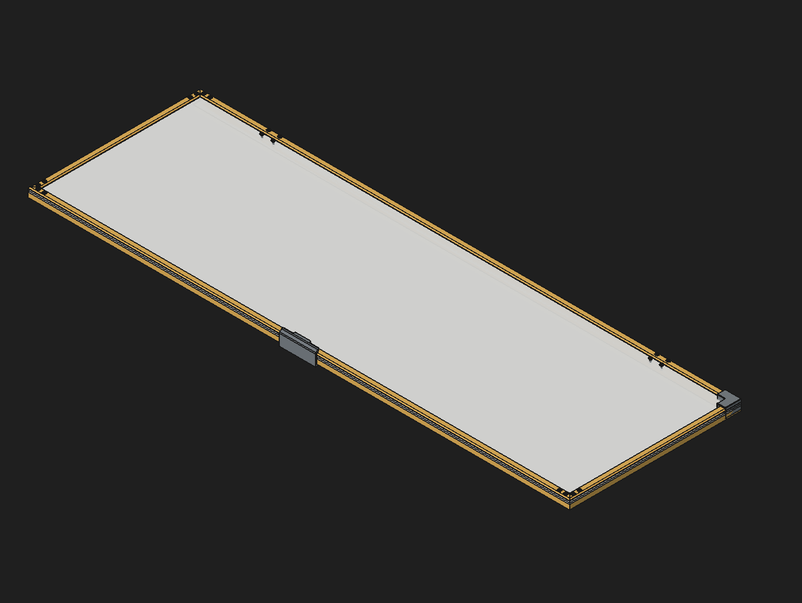

# Fancy Cabinet Door

This project involves building a custom door for a cabinet using 3D printing and woodworking techniques.

## Why I Built This

I built this cabinet door to add a unique and personalized touch to my home decor. Previously we had a metal and glass door, but the pistons stopped working correctly, and we were unable to find a suitable replacement without spending a lot of money.
I did this replacement because I wanted to create something that combined both modern technology (3D printing) and traditional craftsmanship (woodworking) to achieve a distinctive look.

## Images

CAD - click to expand

## Features

- Wooden frame with a mid-opaque acrylic panel
- Made as cheap as possible with locally sourced materials
- 3D printed handle

## BOM

| Item | Quantity | Description | Link |
| --- | --- | --- | --- |
| 18mm thin plywood | 4m | Thin plywood sheet for the door panel | Sourced locally |
| 18mm thick plywood | 2.5m | Thick plywood for the door frame | Sourced locally |
| 38mm thick plywood | 1.5m | Thick plywood for the door frame | Sourced locally |
| M5 x 25mm countersunk screws | 26 | For assembling the door frame | Sourced locally |
| M5 Nut | 26 | For assembling the door frame | Sourced locally |